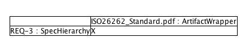
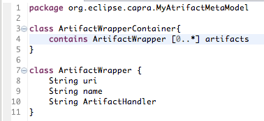

# Capra Help Contents

## User Guide

###  Introduction - What is Capra

Capra is a dedicated traceability management tool that allows the creation, management, visualization, and analysis of trace links within Eclipse. Trace links can be created between arbitrary artifacts, including all EMF model elements, all types of source code files supported by the Eclipse Platform through specialized development tools, tickets and bugs managed by Eclipse Mylyn, and all other artifacts for which an appropriate wrapper is provided. Capra is highly configurable and allows users to create their own traceability meta-model.

Compared to other similar projects which may have similar features, Capra is not a modeling tool or a tool for requirements management. All functionality is focused on providing traceability capabilities, i.e., the ability to create and visualize links between artifacts modeled in different domain-specific languages. This allows the architecture to be highly modular and the tool to be extremely customizable.

###  Getting Started

This section describes the prerequisites to run Capra and how to install the tool.

#### Prerequisites

Before downloading and using Capra, first download a distribution of the Eclipse Modeling Environment (Eclipse V 4.5 (Mars)) and make sure you have the following installed:

* [PlantUML](http://plantuml.com/eclipse.html): Use the nightlies [update site](http://basar.idi.ntnu.no/svn/tdt4100/anonymous/trunk/updatesite) in Eclipse's "Install new software..." feature. Version 1.1.11 or higher should be installed through this link. Older versions advertised on the website will not work! It might also be necessary to install [Graphviz](http://www.graphviz.org) binaries on your system to view the visualisation of trace links.
* [Xcore](https://wiki.eclipse.org/Xcore): Install through Eclipse's "Install new software..." feature
* [Mylyn](https://www.eclipse.org/mylyn/): Install the "Mylyn Builds Connector: Hudson/Jenkins" through Eclipse's "Install new software..." feature
* [C/C++ Development Tools](https://www.eclipse.org/cdt/): : Use Eclipse's "Install new software..." feature
* [Java Development Tools](https://www.eclipse.org/jdt): Use Eclipse's "Install new software..." feature
* [Xtend](https://eclipse.org/xtend/): Install through the Eclipse Market Place
* [Papyrus](https://eclipse.org/papyrus/): Install through the Eclipse Market Place  


#### Installing Capra

Capra can be installed either through an update site or manually .

##### Installing through an update site
* Go to the [Capra GitHub repository](https://github.com/Salome-Maro/TraceabilityManagement).
* Click on "Releases" (Please note that the current release is a Pre-release and the official release will be available once the tool is an Eclipse project)
* Download the file `Capra_v.0.1.zip` (Note the location of your download)
* Open your Eclipse environment
* Make sure that you have all the dependencied listed above installed
* Click on Help >> Install New Softaware
* Click on Add and select Archive
* Select your zip file and click Add
* You should see the features that Capra has grouped into several categories.
* To get a minimum version of Capra working, install all the features in Core and at least one artifact wrapper. This means that if you for instance install only the EMFHandler, then you will only be able to create traceability links between EMF models. It is recommended to install all available artifact handlers.
* Install the features in the visualization and notification categories in order to get their functionality working. 
* Restart Eclipse
* Go to perspectives and switch to the Capra perspective
* Now you can create traceability links as described in [Creating Traceability Links](#create-trace-links).


#####  Manual installation (Import from Git)
* Open your Eclipse Environment
* Go to File >> Import and select Git >> Projects from Git
* Use the [GitHub repository](https://github.com/Salome-Maro/TraceabilityManagement) and import all available projects to your workspace
* Build your workspace
* Make sure that all the projects have no errors.
* Click on Run >> Run Configurations and create a new Eclipse Application Configuration
* Select your running workspace
* Click Finish
* Once the new workspace opens, create or import projects that you want to use to create traceability links
* Go to perspectives and switch to the Capra perspective
* Now you can create traceability links as described in [Creating Traceability Links](#create-trace-links).


### Traceability Concepts

In this section, important concepts for traceability are described.

#### Definition of traceability

Traceability can be defined as the ability to relate different artifacts created during the development of a software system. Traceability allows creating and using links between system and software development artifacts. For instance, this allows connecting the origin of a requirement with its specification, the design elements that address its specification, the code that implements these design elements, and the acceptance tests that check if the requirement has been achieved.

#### What is a traceability link?

The connections between different artifacts in a software development environment are called traceability links. A traceability link can connect two or more elements to imply that there is a relationship between these elements.

#### Types of traceability links

Depending on the requirements of a domain, traceability links can have different types. There are three different categories that can lead to different types of traceability links: the shape of a link, the semantics of a link, and the direction of a link. 

* Link Shape: 
A link can have a source and target which means that you can only use it to connect two artifacts, or it can be of N-nary type, meaning that you can connect more than two artifacts using the same link.
* Link Semantics:
Traceability links can carry different semantics. The semantics of a link can be implied through the link name, e.g., "satisfies", "implements", "tests". It is also possible to enforce "technical" restrictions on which kind of artifacts a link can connect. For example, a "tests" link type can only allow connecting a test to a requirement. Link semantics are defined through a [traceability metamodel](#traceability-metamodel) and are configurable in Capra.
* Direction of a link:
A trace link can be either a directed link or a bi-directional link. A directed link has a "source" and "target(s)" relationship where the link is from the source and points to the target(s). A directed link also means that one can navigate from "source" to target(s) but not vice versa. A bi-directional link means that the link has no semantics in the direction and one can navigate from any connected artifact to the other connected artifact(s).

#### What is an artifact?
Artifacts, and in particular software development artifacts refer to the resources that are either created or used as an input by a software development activity. For instance, the requirements elicitation activity produces artifacts known as requirements. Artifacts can be of different types, such as a requirement, a model element, a line of code, or a test case.

#### What is an artifact handler?

As previously mentioned, there are different types of artifacts that can exist in a software development environment. However, Capra stores the traceability links in form of an EMF model. This means that, basically only EMF artifact types can be supported. To support other artifact types, there is a need to create EMF representations of the artifacts. This is what an artifact handler does. It creates an EMF representation of non-EMF artifacts. The representations are known as "artifact wrappers". For example to be able to link to Java Code, an artifact handler for Java needs to created. For details on how to add new artifact handlers to the tool, refer to section [Adding a new artifact handler](#new-artifact-handler). 

###  Practical Examples
To demonstrate features of Capra, we take an example of the development of a Heating, Ventilation and Air Conditioning (HVAC) System.  The project contains the following artifacts:

* A set of requirements which are written in [ReqIF](http://www.omg.org/spec/ReqIF/) format.
* A feature model describing the different features that can form several products of the HVAC system.
* State machines used to describe the behavior of the system
* Generated code from the state machines 
* Test cases defined as Java Unit tests and 
* Issues/Tasks/Tickets reported as development progresses which are stored on a [Trac](https://trac.edgewall.org/wiki/TracTickets) server

These artifacts are shown in the figure below in the context of the development environment of the HVAC system.


> Can we provide a link to where the project can be downloaded? 

#### Creating Traceability Links <a id="create-trace-links"></a>

Capra provides the functionality to create traceability links between different artifacts as long as artifact handlers for those artifact types are available. The current version supports tracing to EMF models, Java code (up to method level), C/C++ code (up to function level), Task tickets from ticketing systems supported by Mylyn, arbitrary files (such as PDF or word), Test executions (Hudson and Jenkins), Papyrus models, and Capella models. 

To show how traceability links can be created, we continue with the HVAC example and its artifacts as described above. Our aim is to establish the following links. 

1. A link from a requirement to a feature representing the requirement in the feature model
2. A link from a feature to the state machine that describes the behavior of the feature
3. A link from a state machine to test case that tests the behavior described by the state machine
4. A link from a requirement to a PDF document that describes safety issues that need to be considered
5. A link from a task ticket to a requirement that is associated with the ticket

The procedure to create the above links is described below.

##### A link from a requirement to a feature representing the requirement in the feature model

1. To start, open the requirements (`HVAC_Requirements.reqif` file), with the "Sample Reflective Ecore Editor" view. 
2.  Expand the model to see the requirements. Drag Req 3 and drop it in the Selection view. 
3.  Next, open the feature model (`HVAC_Variants.pld`), drag and drop the feature named "Blower" into the selection view as well as shown in the figure below.  

4. Right click on the selection view and click on "Create Trace".  

5. A pop up window will appear, showing the types of links that can be created based on the selected element.
6. Choose a trace link type to create (in our case "RelatedTo") and click OK.                                                   

7. Since this is our first trace link, a new folder will appear in the workspace with the name `__WorkspaceTraceModels`. This folder contains your trace model which contains the trace link we just created and an artifact wrapper model which contains EMF representations of artifacts that are not in EMF format. In our case the artifact model should be empty since the artifacts we used to create the trace link are all EMF elements. The trace model (`traceModel.xmi`) should contain only one trace link.  
	
8. To remove an element from the selection view, right click on an element and select "Remove from Selection".
9. To remove all elements, right click anywhere on the selection view and click on "Clear selection".


##### A link from a feature to the state machine that describes the behavior of the feature

1. From the feature model, drag and drop the feature named "Blower" into the selection view.
2. Open the `BlowerCtlr` state machine and drag and drop the parent element to the selection view.
3. Right click on the selection view and click on "Create Trace".
4. A pop up window will appear, showing the types of links that can be created based on the selected elements.
5. Choose a trace link type to create (in our case "RelatedTo") and click OK.
6. Expand the `__WorkspaceTraceModels` project and open the trace model (`traceModel.xmi`). You will notice that a second trace link has been created.
	
##### A link from a state machine to test case that tests the behavior described by the state machine

1. Clear the selection view.
2. Again, Open the `BlowerCtlr` state machine and drag and drop the parent element to the selection view.
3. Expand the project containing the tests, expand the `BlowerTest.java` file to reveal the BlowerTest class. Drag and drop this class to the selection view.
4. Right click on the selection view and click on "Create Trace".
5. A pop up window will appear, showing the types of links that can be created based on the selected elements.
6. Choose a trace link type to create (in our case "RelatedTo") and click OK.
	
#####  A link from a requirement to a PDF document that describes safety issues that need to be considered
	
1. Clear the selection view.	
2. Expand the folder containing the requirements to reveal its contents.
3. Open the requirements (`HVAC_Requirements.reqif` file), with the "Sample Reflective Ecore Editor" view.
4. Expand the model to see the requirements. Drag Req 3 and drop it in the Selection view. 
5. Select the `ISO26262 Requirements.pdf` file from the Project Explorer and drag and drop it to the selection view
6. Right click on the selection view and click on "Create Trace".
7. A pop up window will appear, showing the types of links that can be created based on the selected elements.
8. Choose a trace link type to create (in our case "RelatedTo") and click OK.

##### A link from a task ticket to a requirement that is associated with the ticket

1. Clear the selection view
2. Drag Req 3 and drop it in the Selection view.
3. From the `Task List` view, where the tasks from the Trac server are listed, select one task and drag and drop it to the selection view
4. Right click on the selection view and click on "Create Trace".
5. A pop up window will appear, showing the types of links that can be created based on the selected elements.
6. Choose a trace link type to create (in our case "RelatedTo") and click OK.


#### Visualizing Traceability Links

Capra offers two ways in which you can visualize the traceability links that you have created. These are the Graphical view where the artifacts are shown as nodes and the links as edges in a graph and the Matrix view where artifacts are arranged in rows and column with an "x" mark in the cells to indicate a trace link between the artifact in the column and that in the specific row.


##### Graphical view

To view the traceability links related to an artifact and the connected artifacts, simply select the artifact while in the "Sample Reflective Editor" View. The "Plant UML View" needs to be open as well.

The graphical view allows you to explore directly connected elements or transitively connected elements.  To use the latter functionality, click on the downward arrow on right hand corner of the Plant UML View and click on "Toggle Transitivity". This enables you to move from viewing only directly connected elements to the selected element, to viewing all the transitively connected elements. Use the same button to return to the previously active view.  


##### Traceability matrix

The traceability matrix can be created by selecting at least two model elements when the "Plant UML View" is open. This will list all the model elements as rows and columns and an "x" mark will appear show that there is a trace link between two elements. For instance, the picture below shows the resulting matrix when selecting Req3 and the artifact wrapper representing the PDF document. 



Selecting more than two model elements expands the matrix into a square matrix with same elements listed in vertically and horizontally. 


#### Detecting and Fixing Inconsistencies

Trace links need to be updated as the artifacts they connect evolve. Capra provides a feature to notify users when these artifacts evolve and give suggestions on how the trace links can be evolved. The suggestions are offered as quick fixes to the user and if the user wishes to make the changes suggested by the quick fix, the fix can be applied automatically by clicking on it. 

The problems detected by Capra are shown in the "Problems" view with a type "Capra problem". We demonstrate the use of the Problems view and quick fixes using our practical example of the HVAC project.

1. Go to the "Project Explorer" and expand the project containing test cases. 
2. Delete the file `BlowerTest.java`.
3. Look at the Problems view and you will see a warning with a type  "Capra problem". The issue tells you that there is a trace link that points to a file named `BlowerTest.java`, but that file has been deleted.  

4. Right-click on the warning and select Quick fix.
5. A window will appear showing the quick fixes options available. In this case there is one option, which is to delete the trace link related to `BlowerTest.java` file.  

6. Click Finish.
7. Notice that the trace link has been deleted and the warning disappears.


#### Analyzing change impact 
In this section, we describe scenarios in which Capra can be used to facilitate change impact analysis. Change impact analysis means being able to evaluate the effect a change to an artifact will have to other artifacts. Using the HVAC example, assume that the customer requests a change on the requirements `REQ-3`. Before such a change is made, it is important for the company to know which other artefacts will be affected. With Capra, this can be done by selecting `REQ-3` and then using the visualization, one can see all other artefacts that are related to `REQ-3`.too. 


For further analysis, clicking on Toggle transitivity as shown in th figure below will show all artifacts connected to `REQ-3` and their connnections to other artifacts 


## Developer Guide

The following subsection describes the technical architecture of the tool. This information is also available in more detail in a tool demonstration paper[^fn1]. Our motivation for choosing this architecture design is based on a study on factors and guidelines that affect how a traceability tool can support traceabilityy maintenance[^fn2]. 

### Architecture of Capra
Capra is an Eclipse plugin and uses the Eclipse Modeling Framework (EMF) as its base technology. It stores the traceability model as an EMF model. The tool relies on the [Eclipse Extension mechanism](https://wiki.eclipse.org/FAQ_What_are_extensions_and_extension_points) and provides extension points for those parts of the tool that can be customized. Based on requirements we collected from many interested parties in the industry, the tool is customizable at four points: 

1. The types of links to be supported;
2. Which types of artifacts can be traced to;
3. How the links should be stored;
4. The artifact handler that should be used in case there is more than one available for one artifact type.

Additionally, Capra has an API which makes traceability data available to other tools. The current version uses the provided traceability data to visualize it graphically.


The figure below depicts the extension points. The rationale for each of them is described in the following.


#### Traceability Metamodel <a id="traceability-metamodel"></a>

Depending on the company, development context, and process used, the traceability links required can differ. For example, traceability links for a company developing web-based solutions are not the same as links for companies developing embedded software. In the former case, traceability links can help connect certain entries in the server configuration files to specific requirements. The traceability links for embedded software need to relate, e.g., the hardware specification to the software design. Both concepts do not make sense in the respective other domain.

To address the different link types, the tool offers an extension point for the traceability metamodel. Here the end user (company), can define the types of links through a metamodel and supply it to the tool. Examples of link types are "verifies", "implements", "refines", "related to" etc. In addition to link types, the metamodel can also define additional information to be stored with each link. It might be desirable, e.g., to store the date and time the link was created or which user created it.

#### Artifact Handler

Software development usually involves a number of activities such as requirements engineering, design, implementation, and testing. In most cases, each of these activities use different tools and produce artifacts of different formats. A traceability tool needs to ensure that the different formats can be traced to and from. Since different companies use different tools, it is not easy to foresee which formats a traceability tool should support. This problem of diverse artifacts existing in the development environment has been noted by several studies on traceability. Our tool offers an extension point for Artifact Handlers which allows adding artifact formats based on the needs of the end users.

As discussed, Capra stores the traceability links as an EMF model. To be able to support tracing to other formats, EMF representations of these other formats are required. Implementing an extension for a certain format means providing an EMF representation of that format to the tool using the artifact handler extension point. 

#### Persistence Handler

The storage of traceability links is another factor that can vary depending on company policies or project set-ups. For some cases it makes sense that there is a traceability model per project while in some cases there can be one traceability model for the whole workspace. The extension point Persistence Handler allows defining such storage locations. It will also allow integrating the traceability model with versioning solutions such as EMF Store, CDO or Git.

#### Priority Handler

In situations where there is more than one artifact handler that can handle the same artifact type, the tool provides an extension point for a so called Priority Handler. Here the user can define which handler should be used. 

#### Capra API

Capra provides several programming interfaces that can be used by other plugins to access the traceability data. Currently, this is in three interfaces which are the `ArtifactMetaodelAdapter`, `TraceMetamodelAdapter` and `TracePersistenceAdapter`. 
The `ArtifactMetaodelAdapter` has method that give you access to the artifact wrappers and their contents, the `TraceMetamodelAdapter` has methods that give you access to the traceability links and the content of the links and the `TracePersistenceAdapter` has methods that give access to the traceability model and the artifact wrapper model. The traceability model containing the traceability links is available to other tools this traceability data can b used for tasks such as impact analysis.

A good example on how these methods can be used is in the plugin `org.eclipse.capra.ui.plantuml`. This plugin utilizes the methods to get the traceability model and its links and also to determine which artifacts are connected by the links. The plugin uses the results of these methods to create a string that can be rendered as a diagram using the PlantUML view. 
For example the in the file `VisualizationHelper`, the method `CreateMatrix()` calls a method `isThereATraceBetween()` which is part of the  `TraceMetamodelAdapter` interface. 


### Adding a custom Traceability metamodel

To define your own traceability metamodel follow the steps below:

1. Create a Java project and name it `org.eclipse.capra.MyTraceabilityMetaModel`
1. Create a new folder and name it `model`
1. In the `model` folder create a new file and name it `MyTraceabilityMetaModel.xcore`. A pop up window will appear asking if you want to add the Xtext nature to the project. Click "Yes".
1. Define your traceability metamodel as required. In our example, we add two types of traceability links i.e "implements" and "tests"  
   
1. Open the `plugin.xml` file of the new project and click on the "Extension Points" tab  
1. Un-check the check box that says "Show only extension points from the required plugins"  
1. In the text box for the "Extension point filter" type "Traceability" and select `org.eclipse.capra.configuration.TraceabilityMetaModel`
1. Click Finish.   
   
1. Another pop up window will appear asking is you want to add the project `org.eclipse.capra.core` to the list of plugin dependencies. Click Yes  
1. Right-click on the newly added extension, and click on "New" then `TraceabilityMetaModelAdapter`. A new `TraceabilityMetaModelAdapter` will be created  
  
1. Click on the newly created `TraceabilityMetaModelAdapter`. On the right hand side, we need to provide a class for this extension, where we will implement all the required interfaces.  
1. Click on "Class" and a pop up window for creating a new class will appear. Make sure the folder is `src` and name your class  
 
    
1. Click Finish and a class will be created with the methods to be implemented in it.   
1. Implement all the methods according to your new custom metamodel. Note that information about what each method does and its parameters can be obtained by hovering the mouse over the respective method name. 

### Adding a custom Artifact metamodel

To define your own artifact metamodel, follow the steps below:

1. In the same project used to define the traceability metamodel, go to the `model` folder, create a new file and name it `artifact.xcore`.
1. Define the artifact metamodel as in the picture below. Note that you can modify this definition to fit your needs.  
 
1. Next, open the `plugin.xml` file of the project and click on the "Extension Points" tab
1. Un-check the checkbox that says "Show only extension points from the required plugins"  
1. In the textbox for "Extension point filter" type "Artifact" and select  `org.eclipse.capra.configuration.ArtifactMetamodel`
1. Right-click on the newly added extension, and click on "New" then `ArtifactMetamodelAdapter`. A new `ArtifactMetamodelAdapter` will be created  
 
1. Click on "Class" and a pop up window for creating a new class will appear. Make sure the folder is `src` and name your class      
    
1. Click Finish and a class will be created with the methods to be implemented in it.   
1. Implement all the methods according to your new custom metamodel. Note that information about what each method does and its parameters can be obtained by hovering the mouse over the respective method name. 

NOTE: To test your new Traceability metamodel and artifact model, first close the project `org.eclipse.capra.generic.tracemodels`. Otherwise that project will be used by Capra.


### Adding a new artifact handler <a id="new-artifact-handler"></a>

In case you want Capra to support an artifact type that is not already supported, you will need to create a new artifact handler for the particular artifact type.

As an example, we describe how the Java artifact handler was added using the following steps:

1. Create a Java project and name it `org.eclipse.capra.handler.jdt`.
1. In the `src` folder of the new project, create a package and name it `org.eclipse.capra.handler.jdt`.
1. Right click on the project, click on "Configure" and select "Convert to Plugin Project"
1. Expand the `META-INF` folder , Open the `MANIFEST.MF` file and click on the "Extensions" tab
1. Click on Add. A pop up window will appear with a list of available extension points.
1. Un-check the checkbox that says "Show only extension points from the required plugins" 
1. In the textbox for "Extension point filter"type "Artifact" and select  `org.eclipse.capra.configuration.ArtifactMetaModel` and click Finish.
1. Another pop up window will appear asking is you want to add the project `org.eclipse.capra.core` to the list of plugin dependencies. Click Yes 
1. Right-click on the newly added extension, and click on "New" then "ArtifactHandler". A new `ArtifactHandler` will be created.  
 
1. Click on the newly created `ArtifactHandler`. On the right hand side, we need to provide a class for this extension, where we will implement all the required interfaces.  
1. Click on "Class" and a pop up window for creating a new class will appear. Make sure the folder is `src` and name your class  
       
1. Click Finish and a class will be created with the methods to be implemented in it. In this case there are only two methods.
1. Implement all the methods according to your new custom metamodel. Note that information about what each method does and its parameters can be obtained by hovering the mouse over the respective method name. 

### Changing the storage location of the traceability model

The storage of the traceability model and the artifact handler model is not fixed and can be modified depending on the users needs and requirements. To change the storage location of the traceability model there are two options.

1. To edit the existing persistence handler project OR 
1. To create a completely new persistence handler.

#### Edit existing Persistence Handler

1. Expand the project `org.eclipse.capra.generic.persistance`.
2. Expand the `src` folder and then the `org.eclipse.capra.generic.persistence` package
3. Open the file `TracePersistenceAdapter.java`.
4. Edit the static variables `DEFAULT_PROJECT_NAME`, `DEFAULT_TRACE_MODEL_NAME` and `DEFAULT_ARTIFACT_WRAPPER_MODEL_NAME` to reflect the new location and new model names for your traceability model and artifact wrapper model.
 
4. Save the project and Run Capra

#### Add a new Persistence Handler
1. Create a Java project and name it `org.eclipse.capra.MyPersistenceHandler`
2. In the `src` folder create a package and name it `org.eclipse.capra.MyPersistenceHandler`.
3. Right click on the project, click on "Configure" and select "Convert to Plugin Project"
4. Expand the `META-INF` folder , Open the `MANIFEST.MF` file and click on the "Extensions" tab.`
5. Click on Add. A pop up window will appear with a list of available extension points.
6. Un-check the checkbox that says "Show only extension points from the required plugins" 
6. In the textbox for "Extension point filter" type "Persistence" and select  `org.eclipse.capra.configuration.persistenceHandler` and click Finish.  
 
7. Another pop up window will appear asking is you want to add the project `org.eclipse.capra.core` to the list of plugin dependencies. Click Yes. 
6. Right-click on the newly added extension, and click on "New" then `persistenceHandler`. A new Persistence Handler will be created.  
 
7. Click on the newly created `persistenceHandler`. On the right hand side, we need to provide a class for this extension, where we will implement all the required interfaces.  
8. Click on "Class" and a pop up window for creating a new class will appear. Make sure the folder is `src` and name your class.

9. Click Finish and a class will be created with the methods to be implemented in it. In this case there are only two methods.
10. Implement all the methods according to your needs. Note that information about what each method does and its parameters can be obtained by hovering the mouse over the respective method name.


### Taking care of multiple handlers for the same artifact type

There are cases where for one artifact type, there are several handlers available. It is important during configuration to select which handler should be given a priority for the particular artifact type. This can be done by editing the code in the Priority Handler as follows:

1. Expand the project `org.eclipse.capra.generic.priority`.
1. Expand the src folder and then the `org.eclipse.capra.generic.priority` package.
1. Open the file `DefaultPriorityHander.java`.
1. Modify the code to have the right handler selected. For instance, the code below selects a `hudsonHandler` when the element selected is a Test element and also a build element.  
 
 

### Adding new source files

It is important to maintain the correct copyright messages, indicating the contributors of each file and that it is covered by the EPL. You can use automation to insert a correct copyright header.

Install the [Eclipse Releng Tools](https://wiki.eclipse.org/Development_Resources/How_to_Use_Eclipse_Copyright_Tool). They contain the copyright tool. Use the following copyright header:

```
Copyright (c) ${date} Chalmers | University of Gothenburg, rt-labs and others.
All rights reserved. This program and the accompanying materials
are made available under the terms of the Eclipse Public License v1.0
which accompanies this distribution, and is available at
http://www.eclipse.org/legal/epl-v10.html
 
  Contributors:
     Chalmers | University of Gothenburg and rt-labs - initial API and implementation and/or initial documentation
```

The Contributors entry can be replaced with the appropriate names. Use "Fix copyrights" from the context menu to add the copyrights to all relevant files in a project or folder.
 

[^fn1]: Maro, S. and Steghöfer, JP., 2016, September. Capra: A Configurable and Extendable Traceability Management Tool. In 2016 IEEE 24th International Requirements Engineering Conference (RE). IEEE.

[^fn2]: Maro, S., Anjorin A., Wohlrab R. and Steghöfer, JP., 2016, September. Traceability Maintenance: Factors and Guidelines. In Automated Software Engineering (ASE), 2016 31st IEEE/ACM International Conference. IEEE.